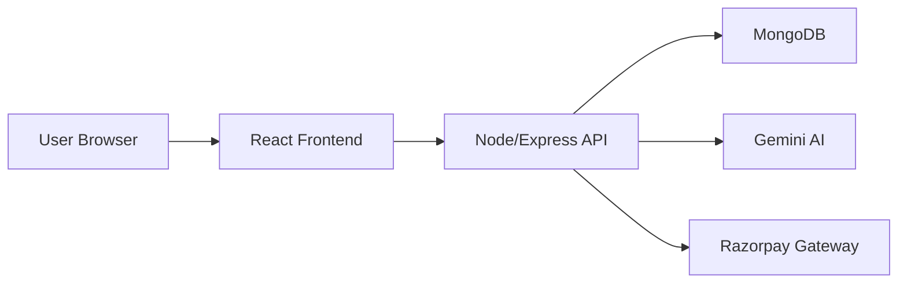

# 🧾 InvoiceAI — Conversational Invoice Management System

[](https://github.com/learnervivek/Invoice-Gen)
[](https://nodejs.org)
[](https://opensource.org/licenses/MIT)
[](https://www.mongodb.com/mern-stack)
[](https://ai.google.dev/)

InvoiceAI is a state-of-the-art, conversational MERN stack application designed to revolutionize how small businesses and freelancers manage their billing. By leveraging the power of Google's Gemini AI, users can generate professional, compliant invoices through a natural chat interface, eliminating the need for complex, manual forms. The platform integrates real-time live previews, professional PDF generation, and secure Razorpay payment processing into a single, cohesive ecosystem.

---

## 📑 Table of Contents

- [Overview](#-overview)
- [Features](#-features)
- [Tech Stack](#-tech-stack)
- [System Architecture](#-system-architecture)
- [Installation & Setup](#-installation--setup)
- [Environment Variables](#-environment-variables)
- [Folder Structure](#-folder-structure)
- [API Documentation](#-api-documentation)
- [Database Schema](#-database-schema)
- [Authentication & Security](#-authentication--security)
- [Payment Integration](#-payment-integration)
- [Deployment](#-deployment)
- [Future Enhancements](#-future-enhancements)
- [Contributing](#-contributing)
- [License](#-license)

---

## 🏗️ Overview

InvoiceAI solves the "clunky form" problem. Traditional invoice generators require menus of inputs for every line item. InvoiceAI allows users to simply type: *"Create an invoice for Vivek for 3 iPhones at 20,000 each"* and watches as the system extracts the data, calculates tax/totals, and prepares a professional document in seconds.

**Target Users:** Freelancers, Small Business Owners, Agency Managers.

---

## ✨ Features

### 🤖 AI-Powered Features
- **Conversational Invoice Building:** Natural language processing via Google Gemini to extract client info, items, and pricing.
- **Smart Data Mapping:** Robust field extraction that understands various terminology (e.g., "rate", "cost", "price") and cleans numeric data.
- **AI Business Insights:** Automatically generates revenue trends and suggestions based on historical invoice data.

### 💳 Core Functionality
- **Real-Time Live Preview:** Instant visual update of the invoice as changes are made.
- **Professional PDF Generation:** Industry-standard PDFs ready for download or client delivery.
- **Dashboard Analytics:** Comprehensive visualization of revenue, paid status, and client growth.

### 🛡️ Security & Scalability
- **JWT-Based Authentication:** Secure, stateless sessions for the MERN architecture.
- **Google OAuth 2.0:** Seamless social login integration.
- **Usage Quotas & Monitoring:** Integrated API tracking to manage Gemini AI usage and prevent abuse (via `ApiUsage` model).
- **Role-Based Access:** Dedicated Admin routes for platform monitoring.

---

## 🛠️ Tech Stack

### Frontend
- **Framework:** React.js (Vite)
- **Styling:** Tailwind CSS, Framer Motion (Animations)
- **State Management:** Zustand
- **UI Components:** Shadcn UI, Lucide Icons, Sonner (Toasts)

### Backend
- **Runtime:** Node.js
- **Framework:** Express.js
- **AI Engine:** Google Generative AI (Gemini 1.5 Flash)
- **Task Scheduling:** Node-Cron (for recurring invoices)

### Database
- **Primary Database:** MongoDB
- **ODM:** Mongoose

### External APIs
- **Payments:** Razorpay SDK
- **Email:** Nodemailer

---

## 📐 System Architecture

### High-Level Flow
1. **Client Layer:** User interacts with the React frontend (Vite-powered).
2. **Conversation Layer:** Prompts are sent to the `/api/chat/message` or `/api/ai/create-invoice` endpoints.
3. **AI Logic Layer:** The backend communicates with Gemini AI to parse the prompt into a structured JSON schema.
4. **Data Layer:** Parsed data is persisted to MongoDB.
5. **Payment Layer:** Razorpay orders are generated and verified via service-side HMAC signature checks.



---

## 🚀 Installation & Setup

### Prerequisites
- Node.js (v18+)
- MongoDB (Local or Atlas)
- Google Cloud Redirect URIs set to `http://localhost:5000/api/auth/google/callback`

### 1. Clone Repository
```bash
git clone https://github.com/learnervivek/Invoice-Gen.git
cd Invoice-Gen
```

### 2. Install Dependencies
```bash
# Install Server dependencies
cd server
npm install

# Install Client dependencies
cd ../client
npm install
```

### 3. Run Application
```bash
# Start Server (from /server)
npm run dev

# Start Client (from /client)
npm run dev
```

---

## 🔑 Environment Variables

Create a `.env` file in the `/server` directory:

```env
# Server Config
PORT=5000
MONGODB_URI=mongodb://localhost:27017/invoice-gen
JWT_SECRET=your_super_secret_key

# Google Gemini AI
GEMINI_API_KEY=your_gemini_api_key

# Razorpay Config
RAZORPAY_KEY_ID=rzp_test_xxxxxx
RAZORPAY_KEY_SECRET=your_razorpay_secret
RAZORPAY_WEBHOOK_SECRET=your_webhook_secret

# URLs
CLIENT_URL=http://localhost:5173
```

---

## 📂 Folder Structure

```text
Invoice-generator/
├── client/                  # Frontend Logic
│   ├── src/
│   │   ├── components/      # Reusable UI Patterns (Shadcn)
│   │   ├── hooks/           # Custom React Hooks (FlowEngine, etc.)
│   │   ├── stores/          # Zustand State Stores (Invoice/Chat)
│   │   └── pages/           # View Layer (Dashboard, ChatPage, etc.)
├── server/                  # Backend Logic
│   ├── controller/          # Request logic & Service orchestration
│   ├── models/              # Mongoose Schemas (User, Invoice, ApiUsage)
│   ├── services/            # Payment, AI & PDF Logic
│   ├── routes/              # API Endpoint Definitions
│   └── middlewares/         # JWT Auth, Error Handling, Admin Guards
```

---

## 📡 API Documentation

### **Conversational AI**
- `POST /api/ai/create-invoice`
  - **Body:** `{ prompt: "Create invoice for Rahul, 2 logos for 500 each" }`
  - **Success:** Returns structured JSON with items, totals, and client info.
- `POST /api/ai/edit-invoice`
  - **Body:** `{ prompt: "Change price to 600", currentInvoice: {...} }`

### **Invoice Management**
- `GET /api/invoices` - Fetch all invoices for authenticated user.
- `POST /api/invoices` - Save invoice to database.
- `PUT /api/invoices/:id` - Update existing record.

---

## 🗄️ Database Schema

### **User Model**
| Field | Type | Description |
|---|---|---|
| `name` | String | User's full name |
| `email` | String | Unique email for auth |
| `companyName`| String | Used in outgoing invoices |
| `address` | String | Business address |

### **Invoice Model**
| Field | Type | Description |
|---|---|---|
| `userId` | ObjectId | Reference to the creator |
| `status` | Enum | draft, sent, viewed, paid, overdue |
| `items` | Array | Objects containing name, qty, unit_cost |
| `total` | Virtual | Computed on the fly (Mongoose virtual) |

---

## 🔒 Authentication & Security

- **JWT Auth:** Every private endpoint is protected by the `auth` middleware, which verifies the `Authorization: Bearer <token>` header.
- **Data Validation:** Zod and Express-Validator are used to sanitize all incoming request bodies.
- **HMAC Verification:** Razorpay webhook and payment verification use HMAC-SHA256 signatures to prevent forgery.

---

## 💳 Payment Integration

### Workflow:
1. **Order Creation:** Client requests an order via `/api/payment/create-order`.
2. **Checkout:** Frontend opens the Razorpay popup.
3. **Verification:** Signature is sent to `/api/payment/verify` to ensure the payment is legitimate before updating the database.
4. **Webhooks:** The server-side `/api/payment/webhook` handles asynchronous "payment.captured" events.

---

## 🚀 Deployment

- **Frontend:** Vercel (recommended for Vite projects).
- **Backend:** Render / Railway / AWS.
- **Database:** MongoDB Atlas (Cloud Cluster).

**Build Command:** `npm run build && vite build`

---

<!-- ## 📸 Screenshots Section

| Dashboard View | AI Chat Interface |
|:---:|:---:|
|  |  | -->


---

## 📄 License

Distributed under the MIT License. See `LICENSE` for more information.

---

*Project by [Vivek Kumar Gupta](https://github.com/learnervivek)*
